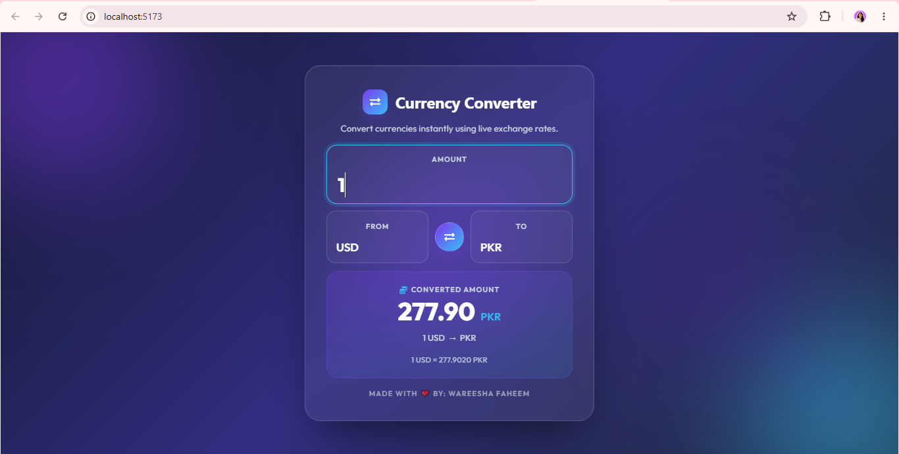

# 💱 Currency Converter

A modern and responsive **Currency Converter** built with **React.js** that provides real-time currency conversion using the **FreeExchangeRate API**. The application features a clean, user-friendly interface with instant conversion results and seamless currency swapping.

---

## ✨ Features

- Real-time currency conversion
- Convert between multiple international currencies
- One-click currency swap
- Live exchange rates via FreeExchangeRate API
- Instant conversion as you type
- Fully responsive modern UI
- Clean and minimal design

---

## 🛠️ Tech Stack

- React.js
- JavaScript (ES6+)
- HTML5
- CSS3
- Fetch API
- FreeExchangeRate API

---

## 📂 Project Structure

```
src/
├── assets/
├── App.jsx
├── App.css
├── index.css
└── main.jsx
```

---

## 🚀 Getting Started

### Clone the repository

```bash
git clone https://github.com/wareesha-faheem/currency-converter.git
```

### Navigate to the project

```bash
cd currency-converter
```

### Install dependencies

```bash
npm install
```

### Run the development server

```bash
npm run dev
```

Open your browser and visit:

```
http://localhost:5173
```

---

## 🌐 API

This project uses the **FreeExchangeRate API** to fetch live exchange rates for accurate and up-to-date currency conversions.

---

## 📸 Preview



---

## 📚 What I Learned

- React Components
- React Hooks (`useState`, `useEffect`)
- API Integration
- Fetch API
- State Management
- Event Handling
- Responsive UI Design

---

## 🚀 Future Enhancements

- Favorite currencies
- Historical exchange rate charts
- Dark/Light mode
- Conversion history
- Currency search
- Currency flags

---

## 🌟 Let's Connect

Thanks for checking out this project!

I'm **Wareesha Faheem**, a Full-stack developer passionate about building clean, responsive, and real-world web applications while continuously exploring modern technologies.

If you enjoyed this project:

- ⭐ Star this repository
- 🍴 Fork it and build something awesome
- 💬 Share your feedback or suggestions

Happy Coding! 🚀
